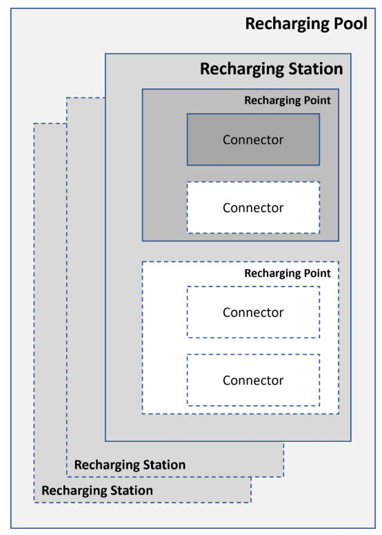
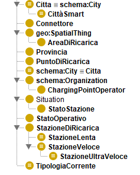
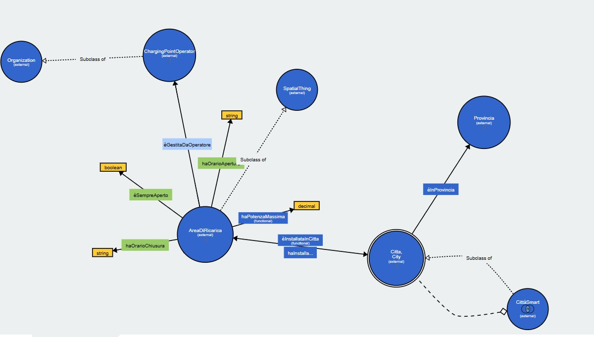
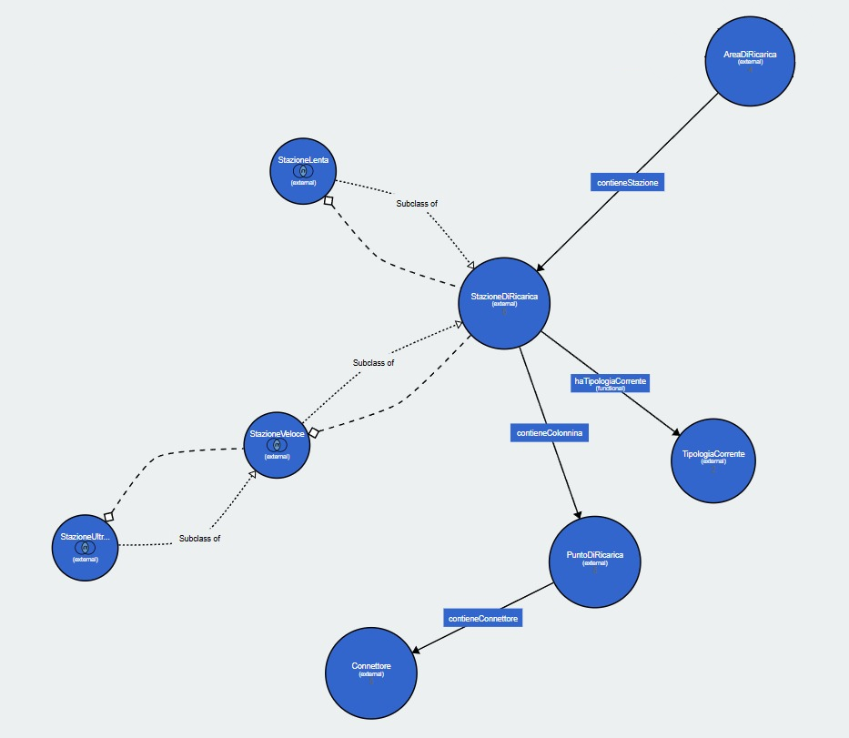
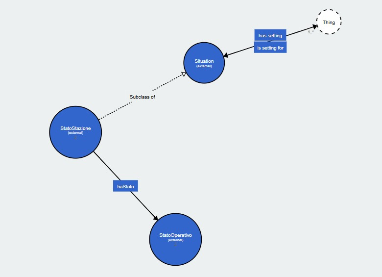
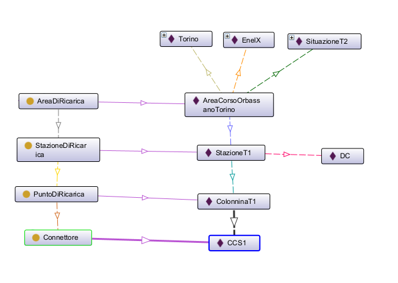

# Relazione

### Motivazioni

L’adozione di veicoli elettrici, specie nei grandi centri urbani, è di grande impatto non solo in termini di sostenibilità ambientale, ma anche di miglioramento della qualità della vita. Modellare e rendere facilmente accessibili informazioni sulle aree di ricarica permette di agevolare gli utenti nell’adozione e nella gestione dei veicoli elettrici. La modellazione dello stato delle stazioni inoltre aiuta a superare la paura di non riuscire a ricaricare il veicolo e/o la sua programmazione. L’acceso a queste informazioni è anche utile alle pubbliche amministrazioni sui territori per aumentare la consapevolezza di quali aree necessitino di maggiore sviluppo/potenziamento della rete. Un modello formale agevola inoltre la gestione infrastrutturale della rete e l’interoperabilità tra sistemi/standard differenti. 

### Task specifici

Consultazione e discovery: consentire agli utenti di trovare stazioni ricarica sul territorio, verificare la compatibilità e disponibilità. Risalire a informazioni tecniche riguardanti le stazioni di ricarica

Reference: funzionare da schema di riferimento per l’integrazione di dati provenienti da più fonti 

### Tipologia di utenti

Cittadini: utenti interessati ad utilizzare il servizio o ad esplorarne l’estensione nel loro territorio per supportare la decisione di acquisto di un veicolo elettrico

Enti pubblici e amministraizoni locali: enti interessati ad una visione dell’infrastruttura per poter guidare le scelte di investimento e potenziamento

Aziende private: aziende operanti nel settore di vendita/leasing di veicoli elettrici per individuare le aree e le tecnologie che necessitano di maggiore intervento 

### Competency Questions

- Quali stazioni di ricarica sono presenti in una determinata città?
- Quali stazioni appartengono a uno specifico operatore?
- Quali stazioni dispongono di ricarica in corrente continua (DC)?
- Quali stazioni possono essere classificate come stazioni ultra-veloci?
- Quali punti di ricarica appartengono a una determinata stazione?
- Qual è la potenza massima disponibile presso una specifica stazione?
- Quali stazioni risultano libere?
- Quali operatori gestiscono infrastrutture in una determinata area geografica?

### Descrizione del dominio

L'elemento centrale del dominio è l'area di ricarica (*recharging pool*), ovvero un luogo fisico identificato da un indirizzo e da coordinate geografiche precise nel quale sono presenti una o più infrastrutture di ricarica. L'area di ricarica rappresenta il punto di riferimento utilizzato per la visualizzazione cartografica delle stazioni e costituisce l'unità territoriale attraverso cui vengono organizzate le infrastrutture disponibili. Ogni area di ricarica è associata a un unico operatore responsabile della sua gestione.

La gestione delle infrastrutture è affidata al *Charging Point Operator* (CPO), il soggetto che si occupa dell'installazione, della manutenzione e del corretto funzionamento delle colonnine. Il CPO garantisce la disponibilità del servizio, monitora lo stato delle infrastrutture e gestisce le risorse necessarie all'erogazione dell'energia. Un singolo operatore può amministrare più aree di ricarica distribuite sul territorio.

All'interno di un'area di ricarica sono presenti una o più infrastrutture di ricarica. Un'infrastruttura corrisponde al dispositivo fisico, come una colonnina o una wallbox, che rende possibile la ricarica dei veicoli elettrici. Sebbene un'infrastruttura sia percepita come un unico oggetto fisico, essa può essere composta da più unità operative in grado di ricaricare contemporaneamente veicoli differenti.

Tali unità operative sono i punti di ricarica (*PDR*). Ogni punto di ricarica rappresenta un'entità indipendente capace di ricaricare un solo veicolo alla volta. Il numero di punti di ricarica associati a una determinata infrastruttura determina il numero massimo di veicoli che possono essere serviti simultaneamente. Dal punto di vista tecnico, il punto di ricarica corrisponde a quella che viene comunemente indicata come EVSE (*Electric Vehicle Supply Equipment*).



Per consentire il collegamento tra veicolo e punto di ricarica vengono utilizzati i connettori. Il connettore costituisce l'interfaccia fisica attraverso cui avviene il trasferimento dell'energia e può essere rappresentato da una presa o da un cavo integrato nell'infrastruttura. Esistono diverse tipologie di connettori, che differiscono per forma, compatibilità e potenza supportata. Un punto di ricarica può mettere a disposizione uno o più connettori, permettendo agli utenti di verificare la compatibilità con il proprio veicolo prima dell'utilizzo.


Una caratteristica fondamentale delle infrastrutture e dei punti di ricarica è la potenza di ricarica, espressa in kilowatt (kW). Essa indica la velocità con cui l'energia viene trasferita al veicolo e rappresenta uno dei principali parametri utilizzati per descrivere una stazione di ricarica. La potenza effettivamente disponibile può variare in funzione di diversi fattori, tra cui il numero di veicoli collegati contemporaneamente, le caratteristiche dell'impianto e la disponibilità della rete elettrica locale.

Oltre agli aspetti tecnici, il dominio comprende anche informazioni relative allo stato operativo delle infrastrutture. La conoscenza dello stato di funzionamento dei punti di ricarica è essenziale per garantire la fruibilità del servizio e consentire agli utenti di individuare le stazioni effettivamente disponibili.

Dal punto di vista territoriale, le aree di ricarica sono collocate all'interno di città e contesti geografici ben definiti. La localizzazione geografica assume un ruolo particolarmente importante poiché permette di rappresentare le infrastrutture su mappe e sistemi di navigazione, facilitando la ricerca delle stazioni più vicine e l'analisi della distribuzione della rete di ricarica sul territorio.

### Dati di esempio

I dati di esempio sono stati presi dalla piattaforma unica nazionale, che mette a disposizione le seguenti informazi per le aree di ricarica presenti in Italia in tempo reale
[https://www.piattaformaunicanazionale.it/idr](https://www.piattaformaunicanazionale.it/idr)


### Documentazione LODE

[http://150.146.207.114/lode/extract?url=https%3A%2F%2Fraw.githubusercontent.com%2FArtorias718%2FMODSEM%2Frefs%2Fheads%2Fmain%2Fontox.rdf&lang=it](http://150.146.207.114/lode/extract?url=https%3A%2F%2Fraw.githubusercontent.com%2FArtorias718%2FMODSEM%2Frefs%2Fheads%2Fmain%2Fontox.rdf&lang=it)

### Tassonomia delle classi



### Grafo delle entità





### ODP usato: Situation

[https://github.com/odpa/patterns-repository/tree/master/Situation](https://github.com/odpa/patterns-repository/tree/master/Situation)

Il pattern Situation è stato usato per modellare lo stato di disponibilità di una stazione di ricarica



### Principali templates




### Triple di esempio

| Soggetto | Predicato | Oggetto |
| --- | --- | --- |
| AreaCorsoOrbassanoTorino | rdf:type | AreaDiRicarica |
| AreaCorsoOrbassanoTorino | rdf:type | owl:NamedIndividual |
| AreaCorsoOrbassanoTorino | contieneStazione | StazioneT1 |
| AreaCorsoOrbassanoTorino | hasSetting | SituazioneT2 |
| AreaCorsoOrbassanoTorino | èInstallataInCitta | Torino |
| AreaCorsoOrbassanoTorino | èGestitaDaOperatore | EnelX |
| AreaCorsoOrbassanoTorino | haPotenzaMassima | 250 |
| AreaCorsoOrbassanoTorino | èSempreAperto | true |
| AreaCorsoOrbassanoTorino | geo:lat | 45.11 |
| AreaCorsoOrbassanoTorino | geo:long | 7.683 |

| Soggetto | Predicato | Oggetto |
| --- | --- | --- |
| StazioneT1 | rdf:type | StazioneDiRicarica |
| StazioneT1 | rdf:type | owl:NamedIndividual |
| StazioneT1 | contieneColonnina | ColonninaT1 |
| StazioneT1 | haTipologiaCorrente | DC |
| StazioneT1 | rdfs:comment | "Stazione di ricarica elettrica T1."@it |
| StazioneT1 | rdfs:label | "Stazione di Ricarica T1"@it |

| Soggetto | Predicato | Oggetto |
| --- | --- | --- |
| ColonninaT1 | rdf:type | Colonnina |
| ColonninaT1 | rdf:type | owl:NamedIndividual |
| ColonninaT1 | haConnettore | CCS1 |
| ColonninaT1 | haConnettore | CHAdeMO |
| ColonninaT1 | haPotenzaNominale | 150 |
| ColonninaT1 | haStatoOperativo | Disponibile |
| ColonninaT1 | rdfs:comment | "Colonnina ad alta potenza installata presso la stazione T1."@it |
| ColonninaT1 | rdfs:label | "Colonnina T1"@it |

### Query SPARQL

#### Query 1

**Descrizione:** Recupera tutte le stazioni di ricarica presenti nel dataset e la relativa tipologia di corrente associata (ad esempio AC o DC).

```cpp
PREFIX ont: <http://www.semanticweb.org/harbi/ontologies/2026/5/untitled-ontology-24/>

SELECT ?stazione ?tipologia
WHERE {
  ?stazione rdf:type ont:StazioneDiRicarica ;
            ont:haTipologiaCorrente ?tipologia .
}
```

Esempio risultato


#### Query 2

Elenca le città con la relativa provincia, le aree di ricarica installate e la potenza massima disponibile, ordinate per città.

```cpp
PREFIX ont: <http://www.semanticweb.org/harbi/ontologies/2026/5/untitled-ontology-24/>

SELECT ?citta ?provincia ?area ?potenza
WHERE {
  ?citta ont:èInProvincia ?provincia .
  ?area ont:èInstallataInCitta ?citta ;
        ont:haPotenzaMassima ?potenza .
}
ORDER BY ?citta
```


#### Query 3

Recupera tutti i connettori disponibili nella città di Torino.

```cpp
PREFIX ont: <http://www.semanticweb.org/harbi/ontologies/2026/5/untitled-ontology-24/>

SELECT ?connettore
WHERE {
  ?area ont:èInstallataInCitta ont:Torino .
  ?area ont:contieneStazione ?stazione .
  ?stazione ont:contieneColonnina ?colonnina .
  ?colonnina ont:contieneConnettore ?connettore .
}
```


#### Query 4

Conta il numero di stazioni di ricarica per ciascuna tipologia di corrente, raggruppando i risultati per tipo di corrente.

```cpp
PREFIX ont: <http://www.semanticweb.org/harbi/ontologies/2026/5/untitled-ontology-24/>

SELECT ?tipoCorrente (COUNT(?stazione) AS ?totale)
WHERE {
  ?stazione ont:haTipologiaCorrente ?tipoCorrente .
}
GROUP BY ?tipoCorrente
```


#### Query 5

Recupera le stazioni di ricarica ultra veloci situate nella provincia di Torino che dispongono di almeno un connettore di tipo CCS1.

```cpp
PREFIX ont: <http://www.semanticweb.org/harbi/ontologies/2026/5/untitled-ontology-24/>

SELECT DISTINCT ?stazione
WHERE {
  # 1. Identifica le stazioni ultra veloci
  ?stazione rdf:type ont:StazioneUltraVeloce .
  
  # 2. Risali alla città e alla provincia
  ?area ont:contieneStazione ?stazione ;
        ont:èInstallataInCitta ?citta .
  ?citta ont:èInProvincia ont:ProvinciaTorino .
  
  # 3. Verifica la presenza del connettore CCS1
  ?stazione ont:contieneColonnina ?punto .
  ?punto ont:contieneConnettore ont:CCS1 .
}
```

### EStensione: SparqlAnyThing

I dati sono stati reperiti tramite download di un file .CSV da https://www.piattaformaunicanazionale.it/, dove i dati hanno il seguente formato:


### Query

```cpp
PREFIX xyz: <http://sparql.xyz/facade-x/data/>
PREFIX ont: <http://www.semanticweb.org/harbi/ontologies/2026/5/untitled-ontology-24/>
PREFIX geo: <http://www.w3.org/2003/01/geo/wgs84_pos>
PREFIX xsd: <http://www.w3.org/2001/XMLSchema#>

CONSTRUCT {

  # Città e provincia
  ?citta a ont:Citta ;
         ont:èInProvincia ?provincia .

  ?provincia a ont:Provincia .

  # Ogni area è associata ad una città e contiene una stazione
  ?area a ont:AreaDiRicarica ;
        ont:èInstallataInCitta ?citta ;
        ont:contieneStazione ?stazione ;
        ont:haPotenzaMassima ?potenza ;
        geo:lat ?latitudine ;
        geo:long ?longitudine .

  # Stazione: Contiene uno o più punti di ricarica e specifica il tipo di corrente
  ?stazione a ont:StazioneDiRicarica ;
            ont:haTipologiaCorrente ?corrente ;
            ont:contieneColonnina ?punto .

  # Punto di ricarica (colonnina)
  ?punto a ont:PuntoDiRicarica ;
         ont:contieneConnettore ?connettore .

  # Connettore
  ?connettore a ont:Connettore .

}
WHERE {
	#Lettura del file csv
  SERVICE <x-sparql-anything:location=data.csv,csv.headers=true> {

      ?row xyz:ID%20EVSE ?id ;
           xyz:Citta ?nomeCitta ;
           xyz:Provincia ?nomeProvincia ;
           xyz:Tipologia%20di%20corrente ?tipoCorrente ;
           xyz:Potenza%20massima%28W%29 ?potenzaVal ;
           xyz:Latitudine ?latVal ;
           xyz:Longitudine ?lonVal .

  }
	# Creazione degli URI deigli individui
  # Città
  BIND(
      IRI(CONCAT(
          "http://www.semanticweb.org/harbi/ontologies/2026/5/untitled-ontology-24/Citta_",
          ENCODE_FOR_URI(STR(?nomeCitta))
      )) AS ?citta
  )

  # Provincia
  BIND(
      IRI(CONCAT(
          "http://www.semanticweb.org/harbi/ontologies/2026/5/untitled-ontology-24/Provincia_",
          ENCODE_FOR_URI(STR(?nomeProvincia))
      )) AS ?provincia
  )

  # Area
  BIND(
      IRI(CONCAT(
          "http://www.semanticweb.org/harbi/ontologies/2026/5/untitled-ontology-24/Area_",
          STR(?id)
      )) AS ?area
  )

  # Stazione
  BIND(
      IRI(CONCAT(
          "http://www.semanticweb.org/harbi/ontologies/2026/5/untitled-ontology-24/Stazione_",
          STR(?id)
      )) AS ?stazione
  )

  # Punto di ricarica 
  BIND(
      IRI(CONCAT(
          "http://www.semanticweb.org/harbi/ontologies/2026/5/untitled-ontology-24/Punto_",
          STR(?id)
      )) AS ?punto
  )

  # Connettore
  BIND(
      IRI(CONCAT(
          "http://www.semanticweb.org/harbi/ontologies/2026/5/untitled-ontology-24/Connettore_",
          STR(?id)
      )) AS ?connettore
  )

  # Individui AC/DC 
  BIND(
      IRI(CONCAT(
          "http://www.semanticweb.org/harbi/ontologies/2026/5/untitled-ontology-24/",
          ENCODE_FOR_URI(STR(?tipoCorrente))
      )) AS ?corrente
  )

  BIND(xsd:decimal(?potenzaVal) AS ?potenza)
  BIND(xsd:decimal(?latVal) AS ?latitudine)
  BIND(xsd:decimal(?lonVal) AS ?longitudine)

}
```

### Triple materializzate

| Soggetto | Predicato | Oggetto |
| --- | --- | --- |
| ont:Connettore_1 | rdf:type | ont:Connettore |
| ont:Punto_1 | rdf:type | ont:PuntoDiRicarica |
| ont:Punto_1 | ont:contieneConnettore | ont:Connettore_1 |
| ont:Stazione_1 | rdf:type | ont:StazioneDiRicarica |
| ont:Stazione_1 | ont:contieneColonnina | ont:Punto_1 |
| ont:Stazione_1 | ont:haTipologiaCorrente | ont:DC |
| ont:Area_1 | rdf:type | ont:AreaDiRicarica |
| ont:Area_1 | ont:contieneStazione | ont:Stazione_1 |
| ont:Area_1 | ont:haPotenzaMassima | "200000"^^xsd:decimal |
| ont:Area_1 | ont:èInstallataInCitta | ont:Citta_Grosseto |
| ont:Area_1 | geo:lat | 42.79063 |
| ont:Area_1 | geo:long | 11.089532 |
| ont:Provincia_Grosseto | rdf:type | ont:Provincia |
| ont:Citta_Grosseto | rdf:type | ont:Citta |
| ont:Citta_Grosseto | ont:èInProvincia | ont:Provincia_Grosseto |
| ont:Connettore_0 | rdf:type | ont:Connettore |
| ont:Punto_0 | rdf:type | ont:PuntoDiRicarica |
| ont:Punto_0 | ont:contieneConnettore | ont:Connettore_0 |
| ont:Stazione_0 | rdf:type | ont:StazioneDiRicarica |
| ont:Stazione_0 | ont:contieneColonnina | ont:Punto_0 |
| ont:Stazione_0 | ont:haTipologiaCorrente | ont:DC |
| ont:Area_0 | rdf:type | ont:AreaDiRicarica |
| ont:Area_0 | ont:contieneStazione | ont:Stazione_0 |
| ont:Area_0 | ont:haPotenzaMassima | "120000"^^xsd:decimal |
| ont:Area_0 | ont:èInstallataInCitta | ont:Citta_Bronte |
| ont:Area_0 | geo:lat | 37.783615 |
| ont:Area_0 | geo:long | 14.82634 |
| ont:Provincia_Catania | rdf:type | ont:Provincia |
| ont:Citta_Bronte | rdf:type | ont:Citta |
| ont:Citta_Bronte | ont:èInProvincia | ont:Provincia_Catania |
